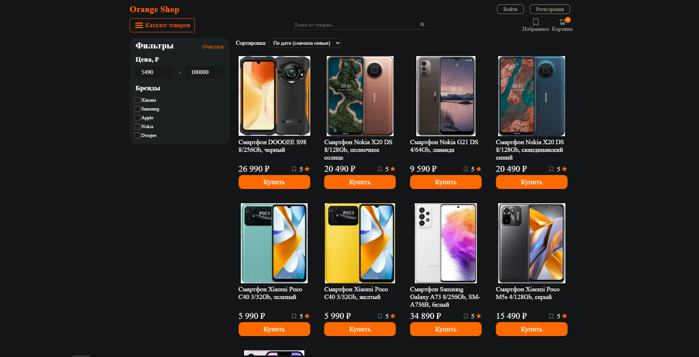
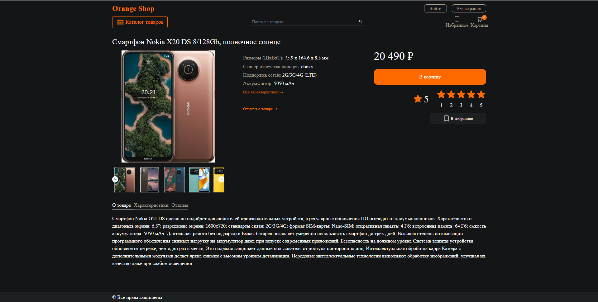
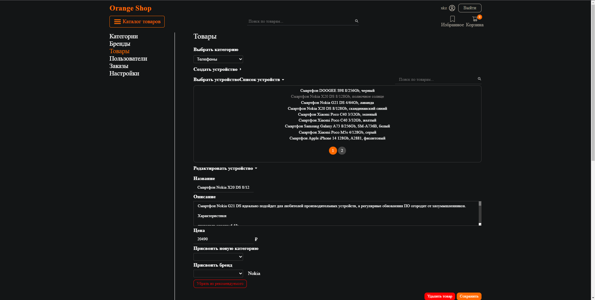
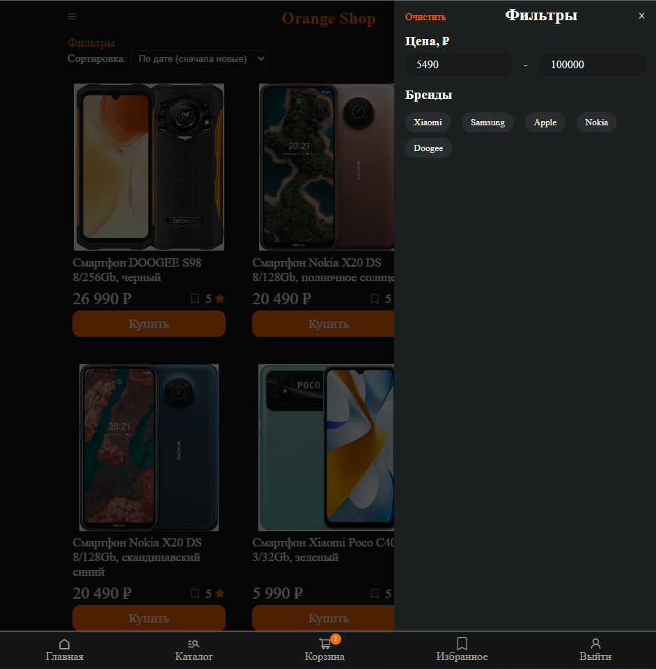

# OrangeShop
Online store of computers and components, office equipment and electronics using PERN Stack.

#### Main page:


#### Catalog page:


#### Current product page:


#### Admin page:


#### Responsive filter page:


## Installation Guide

### Requirements
- [Nodejs](https://nodejs.org/en/download)
- [PostgreSQL](https://www.postgresql.org/download/)

Both should be installed and make sure postgreSQL is running.

```shell
git clone https://github.com/xkz1899/store.git
cd store
```

Install the dependencies.

```shell
cd server
npm install
cd ../client
npm install
cd ..
```
#### Create a database named "newstore" in the database postgreSQL.

#### Start server.

```shell
cd server
npm start
```

#### Start client.

```shell
cd client
npm start
```

Now open http://localhost:3000 in your browser.

The first registered user to receive administrator status.

To enter the admin panel after the administrator authorization, go to http://localhost:3000/admin.